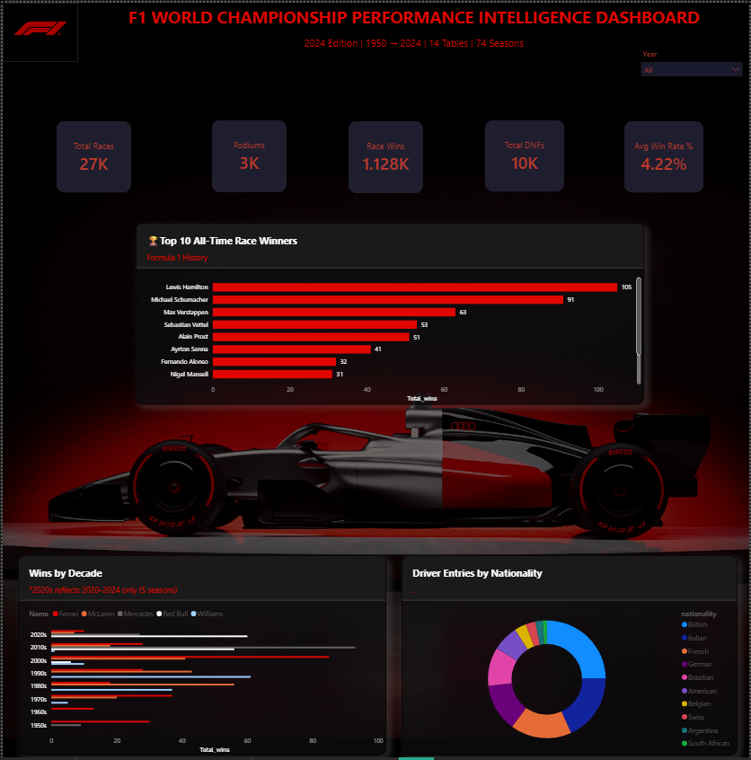
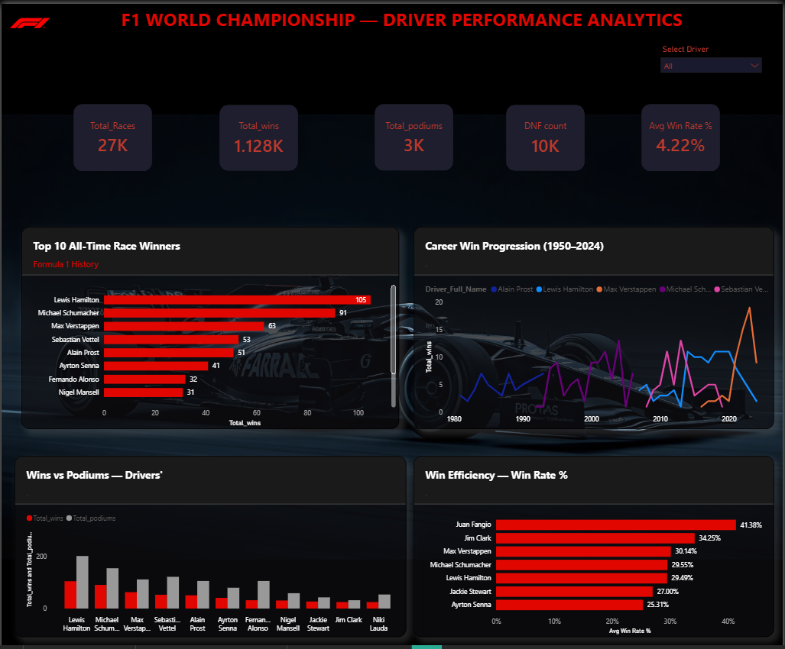
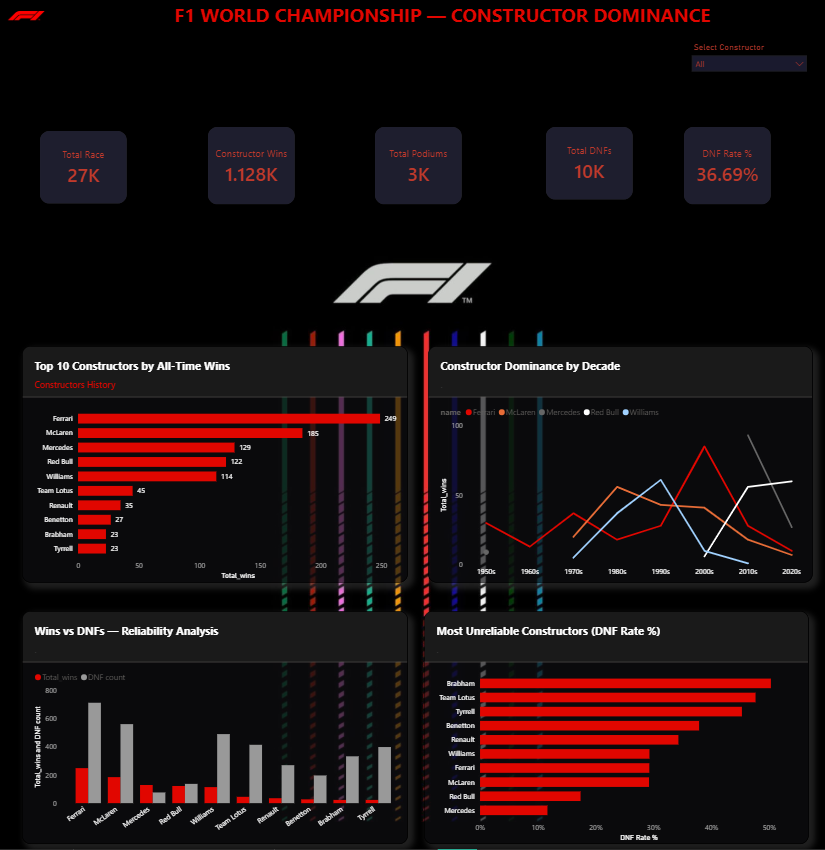
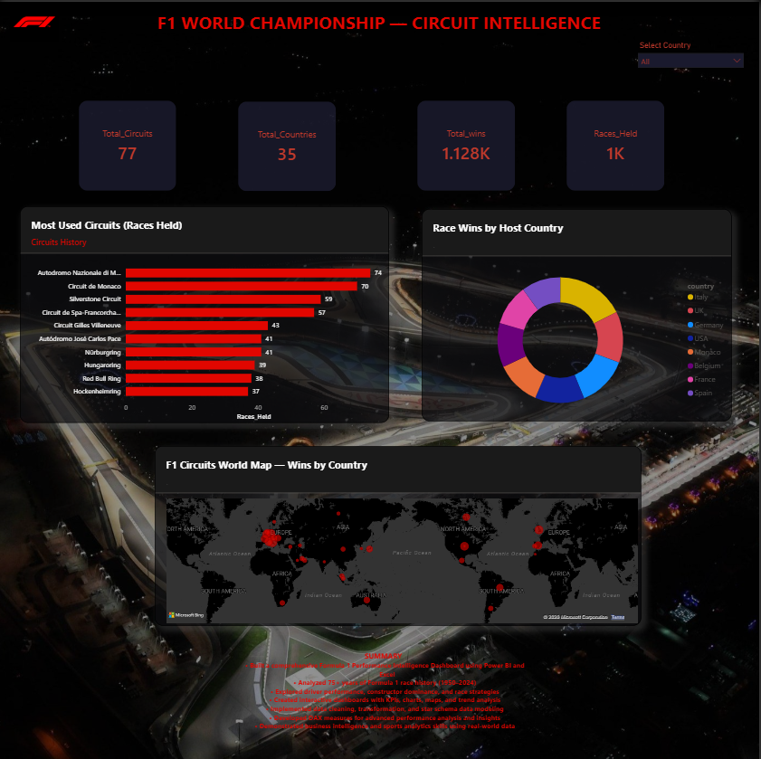

# 🏎️ F1 World Championship — Performance Intelligence Dashboard


---

## 📌 Project Overview

This project builds a comprehensive **5-page Power BI Performance Intelligence Dashboard**
integrating **14 relational tables** from the Formula 1 World Championship dataset
spanning **75 years of race history (1950–2024)**.

The dashboard replicates a real-world **sports analytics use case** — the kind of tool
used by F1 teams, broadcasters, and race strategists to make data-driven performance
decisions across drivers, constructors, circuits, and race strategies.

> *"75 seasons of data distilled into three analytical pillars:
> Driver Analytics, Constructor Dominance, and Circuit Intelligence."*

---

## 🎯 Problem Statement

Formula 1 produces a huge amount of data every season including race results, lap times,
pit stops, and qualifying performance. However, understanding this data in a meaningful
way is difficult without proper analysis and visualization.

Driver stats, team records, circuit data, and strategic insights are rarely visualized
together in one unified analytical tool.

**This dashboard answers:**
- Which drivers have the highest win-rate efficiency?
- Which constructors delivered the most consistent finishing record?
- How has constructor dominance shifted across 7 decades of F1?
- Which circuits favour certain teams?
- How does qualifying position translate to race outcome?

---

## 🖥️ Dashboard Pages

### 🏠 Page 1 — HOME
Navigation hub with action buttons linking to all dashboard pages.
F1 car hero image, project title, and professional branding.

---

### 📈 Page 2 — SEASON COMMAND CENTER


| Visual | Description |
|---|---|
| 5 KPI Cards | Total Races · Total Wins · Total Podiums · Total DNFs · Win Rate % |
| Year Slicer | Range slider 1950–2024 — filters all visuals |
| Top 10 Drivers | Horizontal bar chart — Hamilton 105, Schumacher 91, Verstappen 63 |
| Wins by Decade | Constructor wins per decade — Ferrari/McLaren/Mercedes/Red Bull/Williams |
| Nationality Donut | Driver race entries by nationality — British dominance visible |

> 💡 **Key Insight:** Red Bull achieved 93 wins in the 2010s — highest single-decade total by any constructor.

---

### 👤 Page 3 — DRIVER ANALYTICS


| Visual | Description |
|---|---|
| Driver Slicer | Dropdown — select any of 860+ drivers |
| 5 Dynamic KPI Cards | Updates per selected driver |
| Top 10 Bar Chart | All-time race winners |
| Career Line Chart | Win progression year by year |
| Wins vs Podiums | Shows podium-to-win conversion gap |
| Win Efficiency | Top 10 by Win Rate % (filtered: races > 50) |

> 💡 **Key Insight (Hamilton selected):** 356 Races | 105 Wins | 202 Podiums | 44 DNFs | **29.49% Win Rate** — peak seasons 2014 & 2015 (11 wins each, Mercedes era)

---

### 🏗️ Page 4 — CONSTRUCTOR DOMINANCE


| Visual | Description |
|---|---|
| Constructor Slicer | Select any team |
| All-Time Wins Bar | Ferrari 249 → McLaren 185 → Mercedes 129 → Red Bull 122 → Williams 114 |
| Decade Line Chart | Era shifts — Ferrari 1950s → McLaren 1980s → Williams 1990s → Ferrari 2000s → Mercedes 2010s → Red Bull 2020s |
| Wins vs DNFs | Reliability analysis per constructor |
| DNF Rate Bar | Most unreliable constructors (entries > 200 filter) |

> 💡 **Key Insight:** Ferrari leads all-time with 249 wins but **29.27% DNF rate**. Mercedes is the most reliable modern team at just **11.66% DNF rate** — explaining their 2010s dynasty.

---

### 🗺️ Page 5 — CIRCUIT INTELLIGENCE


| Visual | Description |
|---|---|
| Country Slicer | Filter all visuals by host nation |
| 4 KPI Cards | 77 Circuits · 35 Countries · Total Wins · Races Held |
| World Map | 77 circuits plotted with bubble size = wins by country |
| Most Used Circuits | Monza 74 · Monaco 70 · Silverstone 59 · Spa 57 |
| Host Country Donut | Italy · UK · Germany · USA · Monaco dominate |

> 💡 **Key Insight:** Autodromo Nazionale di Monza is the most-used circuit with **74 races held** — European nations dominate F1 hosting history.

---

## 🗄️ Dataset

| Property | Details |
|---|---|
| **Name** | Formula 1 World Championship (1950–2024) |
| **Source** | [Kaggle — rohanrao/formula-1-world-championship](https://www.kaggle.com/datasets/rohanrao/formula-1-world-championship-1950-2020) |
| **Compiled by** | Ergast Motor Racing Developer API — ergast.com/mrd |
| **License** | CC0: Public Domain |
| **Version** | Version 24 — 21.99 MB |
| **Files** | 14 CSV files · 120 columns |

### 14 Tables

| Table | Rows | Key Columns |
|---|---|---|
| **results.csv** ⭐ FACT | 26,000+ | resultId, raceId, driverId, constructorId, position, points |
| races.csv | 1,125+ | raceId, year, round, name, date, circuitId |
| drivers.csv | 860+ | driverId, forename, surname, nationality, dob |
| constructors.csv | 210 | constructorId, name, nationality |
| circuits.csv | 77 | circuitId, name, location, country, lat, lng |
| qualifying.csv | 9,600+ | qualifyId, raceId, driverId, q1, q2, q3 |
| lap_times.csv | 538,000+ | raceId, driverId, lap, position, time |
| pit_stops.csv | 10,000+ | raceId, driverId, stop, lap, duration |
| driver_standings.csv | 34,000+ | raceId, driverId, points, position, wins |
| constructor_standings.csv | 13,000+ | raceId, constructorId, points, position |
| constructor_results.csv | 20,000+ | raceId, constructorId, points, status |
| status.csv | 139 | statusId, status (Finished/Engine/Accident...) |
| seasons.csv | 75 | year, url |
| sprint_results.csv | 200+ | Sprint race results from 2021 onwards |

---

## 🏗️ Data Model — Star Schema

```
                        ┌──────────────────┐
                        │    races.csv     │
                        │    1,125+ rows   │
                        └────────┬─────────┘
                                 │ raceId
           ┌─────────────────────┼──────────────────────┐
           │                     │                      │
  ┌────────┴──────┐    ┌──────────┴──────────┐   ┌───────┴──────────┐
  │  drivers.csv  │    │   results.csv       │   │ constructors.csv │
  │   860+ rows   │────│   FACT TABLE        | ──│   210 rows       │
  └───────────────┘    │   26,000+ rows      │   └──────────────────┘
                       └──────────┬──────────┘
               ┌──────────────────┼──────────────────┐
               │                  │                  │
     ┌─────────┴──────┐  ┌────────┴────────┐  ┌──────┴───────────┐
     │  qualifying    │  │   lap_times     │  │   pit_stops      │
     │  9,600+ rows   │  │  538,000+ rows  │  │  10,000+ rows    │
     └────────────────┘  └─────────────────┘  └──────────────────┘
```

All 14 relationships defined and validated in Power BI Model View.

---

## ⚙️ Tools & Technologies

| Tool | Purpose |
|---|---|
| **Power BI Desktop** | Primary dashboard — 5 pages, star schema, DAX measures |
| **Microsoft Excel** | Preliminary EDA, pivot summaries, data profiling |
| **Power Query (M)** | ETL — null handling, type conversion, calculated columns |
| **DAX** | 8 custom KPI measures |
| **Kaggle** | Data source — 14 CSV downloads |

---

## 📐 DAX Measures

```dax
-- Total Race Wins
Total_wins = 
CALCULATE(COUNT(results[resultId]), results[positionOrder] = 1)

-- Total Podiums
Total_podiums = 
CALCULATE(COUNT(results[resultId]), results[positionOrder] <= 3)

-- Win Rate %
Win Rate % = DIVIDE([Total_wins], [Total_Races], 0)

-- DNF Count (correctly excludes lapped cars)
DNF count = 
CALCULATE(
    COUNT(results[resultId]),
    FILTER('status',
        NOT('status'[status] IN {
            "Finished", "+1 Lap", "+2 Laps", "+3 Laps",
            "+4 Laps", "+5 Laps", "+6 Laps", "+7 Laps",
            "+8 Laps", "+9 Laps", "+10 Laps", "+11 Laps",
            "+12 Laps", "+13 Laps", "+14 Laps", "+15 Laps",
            "+16 Laps", "+17 Laps", "+18 Laps", "+19 Laps",
            "+20 Laps", "+21 Laps", "+22 Laps", "+23 Laps",
            "+24 Laps", "+25 Laps", "+26 Laps",
            "Not classified", "Withdrew",
            "Did not qualify", "Did not prequalify", "Excluded"
        })
    )
)

-- DNF Rate %
DNF Rate % = DIVIDE([DNF count], [Total_Races], 0)

-- Avg Win Rate %
Avg Win Rate % = AVERAGEX(VALUES(drivers[driverId]), [Win Rate %])

-- Distinct Races Held
Races_Held = DISTINCTCOUNT(races[raceId])

-- Total Circuits
Total_Circuits = DISTINCTCOUNT(circuits[circuitId])
```

---

## 🔑 Key Insights

| Category | Insight | Finding |
|---|---|---|
| 🏆 Driver | All-Time Top Driver | Lewis Hamilton — 105 wins · 202 podiums · 29.49% win rate |
| 🏆 Constructor | All-Time Top Constructor | Ferrari — 249 wins across 75 seasons |
| 📈 Decade | Most Dominant Era | Mercedes 2010s — 93 wins, highest single-decade total |
| ⚡ Reliability | Most Reliable Team | Mercedes — 11.66% DNF rate (lowest) |
| ⚠️ Reliability | Most Unreliable Historic | Brabham — 50.30% DNF rate |
| 🗺️ Circuit | Most Used Circuit | Autodromo Nazionale di Monza — 74 races |
| 🌍 Nation | Dominant Driver Nation | British drivers — most wins by nationality |
| 🚀 Modern Era | Fastest Rising Driver | Max Verstappen — 63 wins, 17.39% DNF rate |

---

## 🛠️ Technical Challenges Solved

| Challenge | Solution |
|---|---|
| Circular dependency in `DecadeSort` column | Rewrote using `FLOOR(races[year], 10)` to reference year directly |
| DNF Rate % showing 71% (inflated) | Excluded +1 Lap through +26 Laps status values from DNF count |
| Top N filter not applying on line chart | Switched to bar chart for Top 10 visual; line chart used with single-driver slicer |
| `status` reserved word DAX error | Wrapped table name in single quotes: `'status'[status]` |
| Constructor name not showing in tooltip | Added `constructors[name]` to Tooltips field in line chart |

---

## 🚀 How to Open

1. Download [Power BI Desktop](https://powerbi.microsoft.com/desktop) — free
2. Clone or download this repository
3. Open `F1_Dashboard.pbix`
4. Data is embedded — no extra setup needed
5. Use slicers (Year / Driver / Constructor / Country) to explore

---

## 📁 Repository Structure

```
F1-Performance-Intelligence-dashboard/
│
├── 📊 F1_Dashboard.pbix
├── 📄 README.md
│
├── 📁 screenshots/
│   ├── 01_home.png
│   ├── 02_season_command_center.png
│   ├── 03_driver_analytics.png
│   ├── 04_constructor_dominance.png
│   └── 05_circuit_intelligence.png
│
├── 📁 presentation/
│   └── F1_Dashboard_Presentation.pptx
│
├── 📁 proposal/
│   └── F1_Capstone_Project_Proposal.docx
│
└── 📁 dataset/
    └── dataset_source.txt
```


---

## 📜 License

- **Dataset:** CC0 Public Domain
  (Kaggle — Formula 1 World Championship 1950–2024 by rohanrao)
- **Project:** Open for educational reference

---

> *"Races are won at the track. Championships are won at the factory."*  
